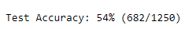

## Project Overview

Welcome to my Convolutional Neural Networks (CNN) project!
In this project, I am going to be building a pipeline to process real-world, user-supplied images and train a model to process these images.
Given an image, the model will predict the most likely locations where the image was taken.

This project helps me demonstrate my understanding of the challenges involved in piecing together a series of models designed to perform various tasks in a data processing pipeline. 

Each model has its strengths and weaknesses, and engineering a real-world application often involves solving many problems without a perfect answer.

### Why We're Here

Photo sharing and photo storage services like to have location data for each photo that is uploaded. With the location data, these services can build advanced features, such as automatic suggestion of relevant tags or automatic photo organization, which help provide a compelling user experience. Although a photo's location can often be obtained by looking at the photo's metadata, many photos uploaded to these services will not have location metadata available. This can happen when, for example, the camera capturing the picture does not have GPS or if a photo's metadata is scrubbed due to privacy concerns.

If no location metadata for an image is available, one way to infer the location is to detect and classify a discernable landmark in the image. Given the large number of landmarks across the world and the immense volume of images that are uploaded to photo sharing services, using human judgement to classify these landmarks would not be feasible.

In this project, we will take the first steps towards addressing this problem by building a CNN-powered app to automatically predict the location of the image based on any landmarks depicted in the image. At the end of this project, the app will accept any user-supplied image as input and suggest the top k most relevant landmarks from 50 possible landmarks from across the world.

## Project Files
In the first notebook `cnn_from_scratch.ipynb` I explored the use of CNNs in training an image classification model by creating a CNN from scratch.  
the second notebook `transfer_learning.ipynb` achieves the same thing as the first, except that in the case I implored the use of a pretrained model with the help of transfer learning technique to achieve a higher prediction accuracy.

### Here is an image of the model performance (using a CNN I built from scratch):


__a test accuracy of 54% is quite impressive considering the small size of the CNN__

## Project Instructions

### Getting started

You have two choices for running this project. You can work locally on your machine (NVIDIA GPU highly recommended), or you can use a cloud service that allows you access to GPU powered servers.

#### Setting up locally

This setup requires a bit of familiarity with creating a working deep learning environment. While things should work out of the box, in case of problems you might have to do operations on your system (like installing new NVIDIA drivers).

1. Open a terminal and clone the repository, then navigate to the downloaded folder:
	
	```	
		git clone https://github.com/chisomdaniel/Landmark-Classification-Tagging-for-Social-Media.git
		cd Landmark-Classification-Tagging-for-Social-Media
	```
    
2. Create a new conda environment with python 3.7.6:

    ```
        conda create --name cnn_project -y python=3.7.6
        conda activate cnn_project
    ```
    
    NOTE: you will have to execute `conda activate cnn_project` for every new terminal session.
    
3. Install the requirements of the project:

    ```
        pip install -r requirements.txt
    ```

4. Install and open Jupyter lab:
	
	```
        pip install jupyterlab
		jupyter lab
	```
  
5. Navigate to the project files and run the notebooks to view.


## Dataset Info

The landmark images are a subset of the Google Landmarks Dataset v2.
